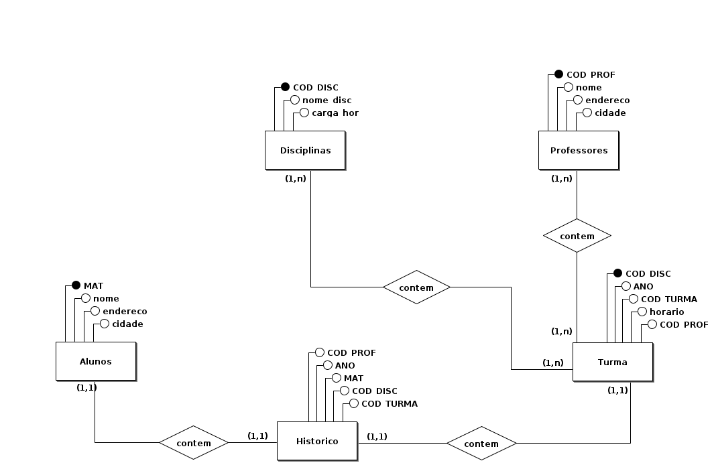
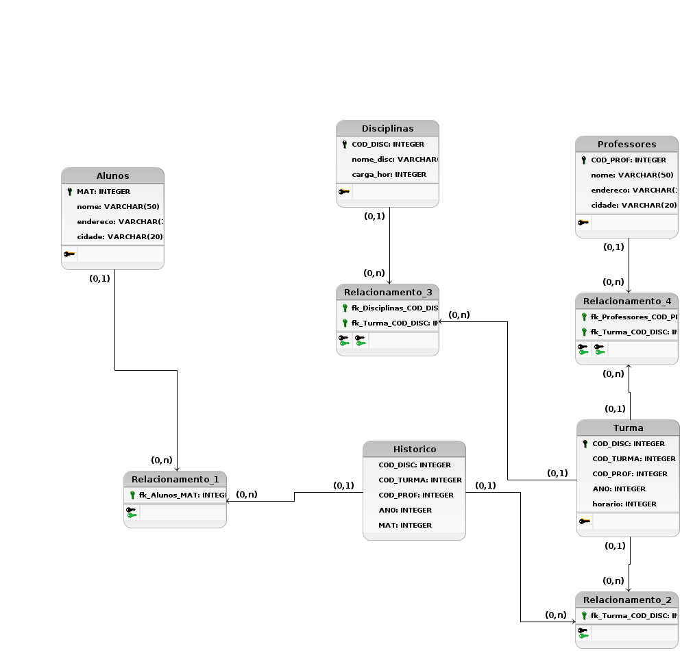

# Prova de banco de dados

Integrantes:

- Pedro Lucas
- Vitor Hugo

## Modelo Conceitual

  

  
## Modelo Lógico 

  

# Descrição das tabelas do modelo Lógico

## Tabela <i>alunos</i>
Tabela <i>alunos</i> se refere aos dados dos alunos cadastrados nesta escola.
Nela possuímos os atributos/colunas:
- MAT: matricula do aluno/chave primária da tabela
- nome: nome do aluno cadastrado
- endereco: endereço do aluno cadastrado nesta escola
- cidade: informação importante referente ao aluno e onde se localiza sua residencia

## Tabela <i>turma</i>
Table <i>turma</i> se refere a turma em que as <i>disciplinas</i> e <i>professores</i> foram atribuidos a ela.
Nela possuímos os atributos/colunas:
- COD_TURMA: deveria ser a chave primária(ouve erros nesta tabela)
- COD_DISC: chave estrangeira
- COD_PROF: chave estrangeira
- ano: ano em que a turma está
- horario: harario em que cada turma irá ter, referente as aulas

## Tabela <i>disciplinas</i>
Tabela <i>disciplinas</i> se refere as disciplinas em que a <i>turma</i> que o aluno foi atribuido irá ter.
Nela possuímos os atributos/colunas:
- COD_DISC: chave primária da tabela
- nome_disc: o nome das disciplinas
- carga_har: a carga horaria em que cada disciplina irá ter

## Tabela <i>professores</i>
Tabela <i>professores</i> se refere ao <i>professores</i> que irá ter em cada <i>turma</i>.
Nela possuímos os atributos/colunas:
- COD_PROF: chave primária da tabela
- nome: nome do professor
- endereco: endereço do professor
- cidade: informação importante referente ao professor e onde se localiza sua residencia

## Tabela <i>historico</i>
Tabela <i>historico</i> se refere a todas as outras tabelas tornando suas chaves primária para cheves estrangeira.
Nela possuímos os atributos/colunas:
- COD_DISC: chave estrangeira
- COD_TURMA: chave estrangeira
- COD_PROF: chave estrangeira
- ano: ano da tabela historico
- MAT: chave estrangeira

## Tabela <i>relacionamento_1/2/3/4</i>
Tabela <i>relacionamento_1/2/3/4</i> tabelas de ligações entre <i>alunos</i> e <i>historico</i>; <i>turma</i> e <i>historico</i>; <i>disciplinas</i> e <i>turma</i>; <i>professores</i> e <i>turma</i>.
Nela possuímos os atributos/colunas:
- fk_alunos_MAT: chave estrangeira que faz referência a tabela <i>alunos</i>
- fk_turma_COD_TURMA: chave estrangeira que faz referência a tabela <i>turma</i>(ouve erros neste relacionamento)
- fk_disciplinas_COD_DISC: chave estrangeira que faz referência a tabela <i>disciplinas</i>
- fk_professores_COD_PROF: chave estrangeira que faz referência a tabela <i>professores</i>

## Licença
Esse código está no domínio público, porque nós não queremos ter responsabilidade nenhuma por ele. 

Se vira 🤨.

## Inspirações

https://github.com/caffeine-squad/modelagem_bd
